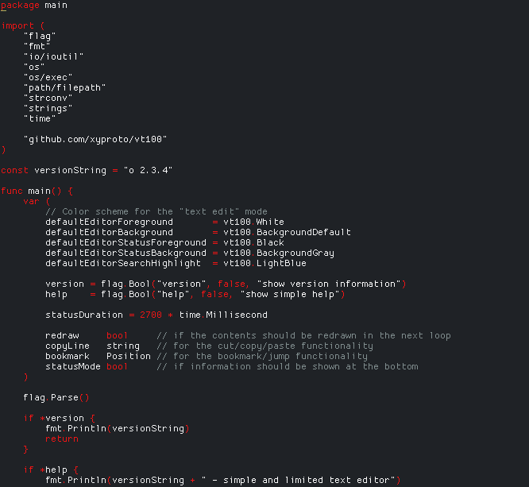

# o   

`o` is yet another editor. It's limited to the VT100 standard, and can be used for programming in Go or C++. It has many limitations, but is small and fast. It's a good fit for writing git commit messages, using `EDITOR=o git commit`.

* Compiles with either `go` or `gccgo`.
* Tested with `st`, `urxvt` and `xfce4-terminal`.
* Tested on Arch Linux and FreeBSD.

For a more feature complete editor that is also written in Go, check out [micro](https://github.com/zyedidia/micro).

<!--## Screenshot

-->

## Quick start

You can install `o` with Go 1.10 or later:

    go get -u github.com/xyproto/o

## Features and limitations

* Has syntax highlighting for Go and C++ code.
* Loads faster than both `vim` and `emacs`, but maybe not as fast as `nano`. It`s hard to tell.
* Can format Go or C++ code, just press `ctrl-w`. This uses either `goimports` (`go get golang.org/x/tools/cmd/goimports`) or `clang-format`.
* Never asks before saving or quitting. Be careful!
* Will strip trailing whitespace whenever it can.
* Must be given a filename at start.
* Smart indentation.
* `Home` and `End` are not detected by the key handler. `ctrl-a` and `ctrl-e` works, though.
* Requires `/dev/tty` to be available.
* Copy, cut and paste is only for one line at a time, and only within the editor.
* Some letters can not be typed in. Like `æ`.
* May take a line number as the second argument, with an optional `+` prefix.
* The text will be red if a loaded file is read-only.
* The terminal needs to be resized to show the second half of lines that are longer than the terminal width.
* If the filename is `COMMIT_EDITMSG`, the look and feel will be adjusted for git commit messages.

## Known bugs

* Lines longer than the terminal width are not handled gracefully.

## Spinner

When loading large files, an animated spinner will appear. The loading operation can be stopped at any time by pressing `esc`, `q` or `ctrl-q`.

## Hotkeys

* `ctrl-q` - Quit
* `ctrl-s` - Save
* `ctrl-w` - Format the current file using `goimport` or `clang-format`. Jump to the problematic line on error when using `goimport`.
* `ctrl-a` - Go to start of line, then start of text on the same line
* `ctrl-e` - Go to end of line
* `ctrl-p` - Scroll up 10 lines
* `ctrl-n` - Scroll down 10 lines
* `ctrl-k` - Delete characters to the end of the line, then delete the line
* `ctrl-g` - toggle filename/line/column/unicode/word count status display
* `ctrl-d` - Delete a single character
* `ctrl-t` - Toggle syntax highlighting
* `ctrl-r` - Toggle text or draw mode (for ASCII graphics)
* `ctrl-x` - Cut the current line
* `ctrl-c` - Copy the current line
* `ctrl-v` - Paste the current line
* `ctrl-b` - Bookmark the current position
* `ctrl-j` - Jump to the bookmark
* `ctrl-h` - Show a minimal help text
* `ctrl-u` - Undo
* `ctrl-l` - Jump to a specific line
* `ctrl-f` - Find a string. Press ctrl-f and return to repeat the search.
* `esc` - Redraw the screen and clear the last search.

## Size

The `o` executable is only **464k** when built with GCC 9.1 (for 64-bit Linux). This isn't as small as [e3](https://sites.google.com/site/e3editor/), an editor written in assembly (which is **234k**), but it's resonably lean.

    go build -gccgoflags '-Os -s'

For comparison, it's **2.9M** when building with Go 1.13 and no particular build flags are given.

## Jumping to a specific line when opening a file

These four ways of opening `file.txt` at line `7` are supported:

* `o file.txt 7`
* `o file.txt +7`
* `o file.txt:7`
* `o file.txt+7`

This also means that filenames containing `+` or `:` are not supported, if followed by a number. Opening files with the `c++` extension works, if you should want that.

## General info

* Version: 2.6.4
* License: 3-clause BSD
* Author: Alexander F. Rødseth &lt;xyproto@archlinux.org&gt;
