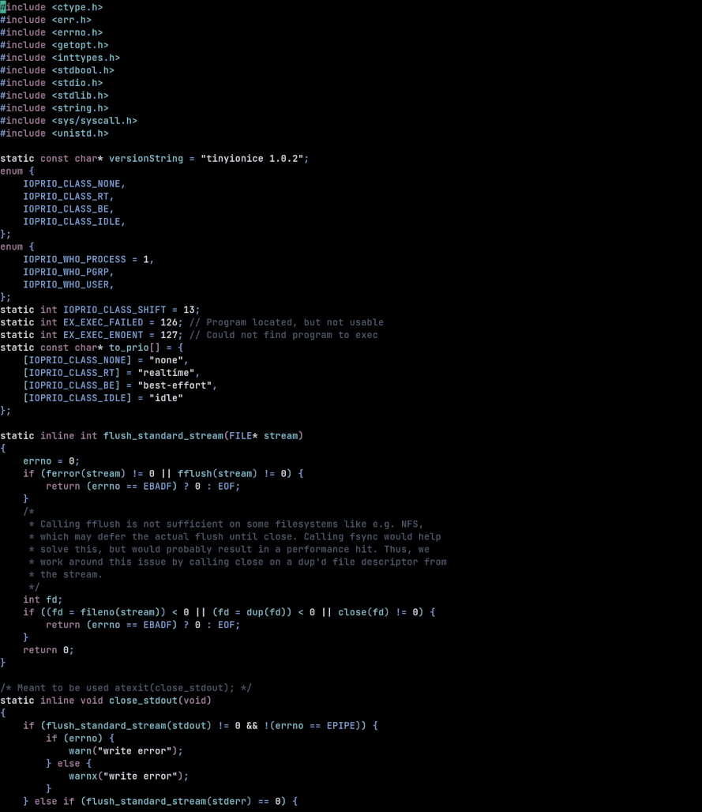
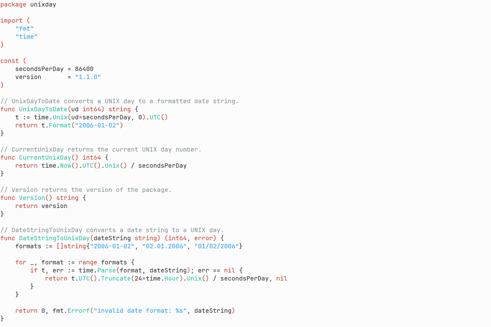
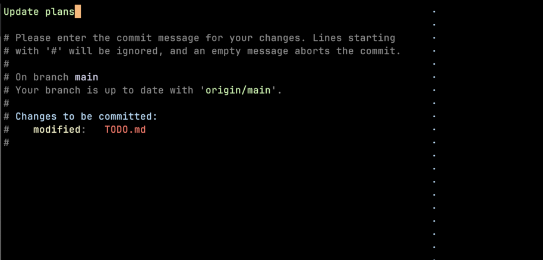
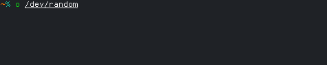

[](https://github.com/xyproto/orbiton/actions/workflows/build.yml) [](https://app.fossa.com/projects/git%2Bgithub.com%2Fxyproto%2Forbiton?ref=badge_shield) [](https://goreportcard.com/report/github.com/xyproto/orbiton/v2) [](https://raw.githubusercontent.com/xyproto/orbiton/main/LICENSE)

Orbiton is a text editor and a simple IDE with the following leading principles:

* **Minimal annoyance** (within the limits of `VT100`)
* **Not be configurable, to help users stay focused** (with the exception of themes)
* **Facilitate rapid edit-format-compile-run cycles**

Please submit a PR if anything can be improved to help adhere to these.

Orbiton might be a good fit for:

* Writing git commit messages (using `EDITOR=o git commit`).
* Editing `README.md` and `TODO.md` files.
* Writing Markdown and then exporting to HTML or PDF.
* Learning programming languages, like Rust or Zig.
* Editing files deep within larger Go or C++ projects.
* Solving Advent of Code tasks.
* Being placed on a live image for a Linux or BSD distro, since it supports VT100, is small and self-contained, has a built-in log, man page and image viewer, has an optional nano/pico mode, can be used as a `visudo` replacement and has built-in support for neatly formatting `/etc/fstab` files.
* Writing any number of words in a distraction-free fullscreen environment (toggle the status bar by pressing `ctrl-g` to see the word count).

This has been my main editor for around 4 years now (since early 2022), and it is mostly written in itself, apart from some NeoViM in the early beginning.

## Screenshots

Screenshot of the VTE GUI application (that can be found in the `gtk3` directory), running the `o` editor:


Stepping through the assembly instructions of a Rust program by entering debug mode with the `ctrl-o` menu and then stepping with `ctrl-n`:


Editing a C source file in `og` using the "synthwave" theme:



There are also light themes available:




Writing commit messages:



## Packaging status

| **orbiton**                                                                                                                    |
|--------------------------------------------------------------------------------------------------------------------------------|
| [](https://repology.org/project/orbiton/versions) |

## Quick start

With Go 1.21 or later, the development version of `o` can be installed like this:

    go install github.com/xyproto/orbiton/v2@latest && mv -i ~/go/bin/orbiton ~/go/bin/o

Adjust the `mv` flags and the `~/go/bin` path as needed. Perhaps `go install` will have an `-o` flag in the future.

Alternatively, download and install a [release version](https://github.com/xyproto/orbiton/releases). For example, for Raspberry Pi 2, 3 or 4 running Linux:

    curl -sL 'https://github.com/xyproto/orbiton/releases/download/v2.71.0/orbiton-2.71.0-linux_armv7_static.tar.xz' | tar JxC /tmp && sudo install -Dm755 /tmp/orbiton-2.71.0-linux_armv7_static/o /usr/bin/o && sudo install -Dm644 /tmp/orbiton-2.71.0-linux_armv7_static/o.1.gz /usr/share/man/man1/o.1.gz

## Setting `o` as the default editor executable for `git`

To set:

    git config --global core.editor o

To unset:

    git config --global --unset core.editor

## Viewing man pages

By setting the `MANPAGER` environment variable, it's possible to use `o` for viewing man pages:

    export MANPAGER=o

An alternative to viewing man pages in `o` is to use `less`:

    export MANPAGER='less -s -M +Gg'

## Setting up `o` on OpenSUSE

Install `o` manually, until an OpenSUSE package exists:

    git clone https://github.com/xyproto/orbiton
    cd orbiton
    make && sudo make install

The following is not strictly needed, but it sets everything up to make full use of `o`:

Add this to `~/.alias`:

    alias o=/usr/bin/o

Add this to `~/.profile`:

    export MANPAGER=/usr/bin/o
    export EDITOR=/usr/bin/o

Log out and in again to activate the changes.

## Unique features

These features are unique to `o`, as far as I am aware:

* If the loaded file is read-only, all text will be red by default.
* Smart cursor movement, trying to maintain the X position when moving up and down, across short and long lines.
* Press `ctrl-v` once to paste one line, press `ctrl-v` again to paste the rest.
* Press `ctrl-c` once to copy one line, press `ctrl-c` again to copy a block of lines (until a blank line), press `ctrl-c` again to copy the current function.
* Open or close a portal with `ctrl-r`. When a portal is open, copy lines across files (or within the same file) with `ctrl-v`.
* Build code with `ctrl-space` and format code with `ctrl-w`, for a wide range of programming languages.
* Cycle git rebase keywords with `ctrl-w` or `ctrl-r`, when an interactive git rebase session is in progress.
* Jump to a line with `ctrl-l`. Either enter a number to jump to a line or just press `return` (or `t`) to jump to the top. Press `ctrl-l` and `return` again (or `b`) to jump to the bottom. Press `c` to jump to the center.
* When jumping to a specific line in a file with `ctrl-l`, jumping to a percentage (like `50%`) or a fraction (like `0.5` or `.5`) is also possible. It is also possible to jump to one of the highlighted letters.
* If tab completion in the terminal went wrong and you are trying to open a `main.` file that does not exist, but `main.cpp` and `main.o` does exists, then `main.cpp` will be opened.
* Search by pressing `ctrl-f`, entering text and pressing `return`. Replace by pressing `tab` instead of `return`, then enter the replacement text and press `return`. Searching for unicode runes on the form `u+0000` is also supported.
* Type `iferr` on a single line in a Go or Odin program and press `return` to insert a suitable `if err != nil { return ... }` block, based on [koron/iferr](https://github.com/koron/iferr).
* Use the built-in Markdown table editor by pressing `ctrl-t` when the cursor is on a table. This works best for tables that are not too wide.
* Format Markdown tables by moving the cursor to a table and pressing `ctrl-w`.
* For C-like languages, missing parentheses are added to statements like `if`, `for` and `while` when return is pressed.
* Pressing `ctrl-f` twice searches for the word under the cursor.
* Lines are highlighted only when the up and down arrow keys are used.
* The name of the function that the cursor is within, is shown in the upper right corner of the screen, for some programming languages.

## Other features and limitations

* The syntax highlighting is instant.
* Opens files quickly.
* Can compile `"Hello, World"` in many popular programming languages simply by pressing `ctrl-space`.
* Create, build and run a simple program in C, by running `o main.c`, pressing `ctrl-w` and then a double `ctrl-space`.
* Configuration-free, for better and for worse.
* Can preview `.png`, `.jpg`, `.jpeg`, `.gif`, `.ico`, `.bmp` and `.webp` images directly in the terminal (using a scaled down version and up to 16 colors).
* The `-p` flag followed by a filename can be used for just pasting the clipboard to a new file, instead of editing a file.
* `ctrl-t` can jump between a C++ header and source file, when editing C++ code.
* `ctrl-t` shows the Markdown table editor, when editing Markdown and the cursor is on a Markdown table.
* Can only edit one file at the time, by design.
* Provides syntax highlighting for Go, Rust, C++, Markdown, Bash and several other languages. There is generic syntax highlighting built-in.
* Will jump to the last visited line when opening a recent file.
* Is provided as a single self-contained executable.
* Loads faster than both `vim` and `emacs`, for small files.
* Can render text to PDF either by itself or by using `pandoc`.
* Tested with `alacritty`, `konsole`, `st`, `urxvt`, `xfce4-terminal`, `xterm` and `zutty`.
* Tested on Arch Linux, Debian, OpenSUSE, macOS, FreeBSD and OpenBSD.
* Never asks before saving or quitting. Be careful.
* The [`NO_COLOR`](https://no-color.org) environment variable can be set to disable all colors.
* Rainbow parentheses makes lines with many parentheses easier to read.
* Limited to VT100, so hotkeys like `ctrl-a` and `ctrl-e` may need to be used instead of `Home` and `End`. And for browsing up and down, `ctrl-n` and `ctrl-p` may be used.
* Compiles with either `go` or `gccgo`.
* Will strip trailing whitespace whenever it can.
* Must be given a filename at start.
* May provide smart indentation.
* Requires that `/dev/tty` is available.
* `xclip` for X, `wl-clipboard` for Wayland or `pbcopy` for macOS needs to be installed to access the system clipboard.
* May take a line number as the second argument, with an optional `+` or `:` prefix.
* If the filename is `COMMIT_EDITMSG`, the look and feel will be adjusted for git commit messages.
* Supports `UTF-8`, but some runes may be displayed incorrectly.
* Only UNIX-style line endings are supported (`\n`).
* Will convert DOS/Windows line endings (`\r\n`) to UNIX line endings (just `\n`), whenever possible.
* Will replace non-breaking space (`0xc2 0xa0`) with a regular space (`0x20`) whenever possible.
* Will replace annoying tilde (`0xcc 0x88`) with a regular tilde (`~`) whenever possible.
* Will replace the greek question mark that looks like a semicolon (`0xcd 0xbe`) with a regular semicolon (`;`) whenever possible.
* If interactive rebase is launched with `git rebase -i`, then either `ctrl-w` or `ctrl-r` will cycle the keywords for the current line (`fixup`, `drop`, `edit` etc).
* If the editor executable is renamed to a word starting with `r` (or have a symlink with that name), the default theme will be red/black.
* If the editor executable is renamed to a word starting with `l` (or have a symlink with that name), the default theme will be suitable for light backgrounds.
* If the editor executable is renamed to a word starting with `s` (or have a symlink with that name), the default theme will be the "synthwave" theme.
* Want to quickly convert Markdown to HTML? Try `o filename.md`, press `ctrl-space` twice and quit with `ctrl-q`.
* The default syntax highlighting theme aims to be as pretty as possible with less than 16 colors, but it mainly aims for clarity. It should be easy to spot a keyword, number, string or a stray parenthesis.
* Press `ctrl-space` or `ctrl-t` to toggle the check mark in `- [ ] TODO item` boxes in Markdown.
* Orbiton is written almost exclusively in Orbiton, with some use of NeoVim for the initial development.
* Can load, edit and save gzipped text files or man pages that ends with a `.gz` extension.
* Can organize imports, for Java and for Kotlin, when formatting code with `ctrl-w`.
* Has a built-in spellchecker (press `ctrl-f` and then `t` to search for a typo, `ctrl-n` for next match and then `ctrl-a` to add it and `ctrl-i` to ignore it).
* Can jump directly to a selection of highlighted letters on the screen, when `ctrl-l` is pressed.

## Known issues

* Some unicode runes may disrupt the text flow! This is generally not a problem for editing code and configuration files, but is an issue when editing files that contains text in many languages, or emojis.
* The man page viewer can not display some special characters, such as the long dash (&mdash;), just yet.
* Using `tmux` or `screen` and resizing the terminal emulator window may trigger text rendering issues. Try pressing `esc` to redraw the text, or `ctrl-f` to search for text. Setting `TERM` correctly might help (but probably not). Using [`zellij`](https://zellij.dev/) instead of `tmux` should work.
* For some terminal emulators, if `o` is busy performing an operation, pressing `ctrl-s` may lock the terminal. Some terminal emulators, like `konsole`, can be configured to turn off this behavior. Press `ctrl-q` to unlock the terminal again (together with the unfortunate risk of quitting `o`). To sidestep this issue, the `ctrl-o` menu can be used instead, for saving and quitting.
* Using `mosh` may cause text rendering issues (in both `nvim` and `o`).
* Pressing `cmd-v`, `cmd-x` and `cmd-c` on macOS only works when using the `og` GUI/VTE frontend. For `o`, `ctrl-v`, `ctrl-x` and `ctrl-c` can be used instead.
* The Markdown table editor does not have scrolling, so the table must fit within the current terminal emulator width and height. Resize the terminal as needed.

## Hotkeys

There are pretty few hotkeys to remember:

* `ctrl-s` - Save.
* `ctrl-q` - Quit.
* `ctrl-r` - Open or close a portal. Text can be pasted from the portal into another (or the same) file with `ctrl-v`.
             For "git interactive rebase" mode (`git rebase -i`), this will cycle the rebase keywords instead.
* `ctrl-a` - Go to start of text, then start of line and then to the previous line.
* `ctrl-e` - Go to end of line and then to the next line
* `ctrl-n` - Scroll down 10 lines, or go to the next match if a search is active.
             Insert a column when in the Markdown table editor.
             Jump to a matching parenthesis or bracket if the arrow keys were just used.
* `ctrl-p` - Scroll up 10 lines, or go to the previous match if a search is active.
             Remove an empty column when in the Markdown table editor.
             Jump to a matching parenthesis or bracket if the arrow keys were just used.
* `ctrl-k` - Delete characters to the end of the line, then delete the line.
* `ctrl-_` - Insert a symbol by typing in a 2-letter [digraph](https://raw.githubusercontent.com/xyproto/digraph/main/digraphs.txt). Try the `--digraphs` or `-s` flag to list all possible digraphs.
* `ctrl-d` - Delete a single character.
* `ctrl-t` - For C and C++: jump between the current header and source file. For Agda and Ivy, insert a symbol.
             For Markdown: toggle checkboxes, or launch the table editor if the cursor is over a table.
             For the rest: record and play back keypresses/"macros". Press `Esc` to clear the current macro.
* `ctrl-o` - Open a command menu with actions that can be performed.
* `ctrl-x` - Cut the current line. Press twice to cut a block of text (to the next blank line).
* `ctrl-c` - Copy one line. Press twice to copy a block of text. Press thrice to copy the current function.
* `ctrl-v` - Paste one trimmed line. Press twice to paste multiple untrimmed lines.
* `ctrl-space` - Build program, render to PDF or export to man page (see table below).
                 For Markdown: toggle checkboxes, or double press to export to HTML.
* `ctrl-j` - Join the current line with the next one.
* `ctrl-u` - Undo (`ctrl-z` is also possible, but may background the application).
* `ctrl-l` - Jump to a specific line number or percentage. Press `return` to jump to the top. If at the top, press `return` to jump to the bottom.
             Press one of the highlighted on-screen letters to jump to that location.
* `ctrl-f` - Search for a string. The search wraps around and is case sensitive. Press `tab` instead of `return` to search and replace.
             To find typos, search for the letter `t`, then press `ctrl-n` for the next word, `ctrl-a` to add it or `ctrl-i` to ignore it.
* `ctrl-b` - Jump back after jumping to a definition or include with `ctrl-g`.
             Toggle a bookmark for the current line, or if set: jump to a bookmark on a different line.
* `ctrl-w` - Format the current file (see the table below), or cycle git rebase keywords. For Markdown, format the table under the cursor.
* `ctrl-g` - Jump to definition, for some programming languages (experimental feature), jump to an include, jump back or toggle the status bar.
* `ctrl-\` - Comment in or out a block of code.
* `ctrl-~` - Insert the current date and time.
* `esc`    - Redraw everything and clear the last search.

## Build and format

* Press `ctrl-space` to build or export the current file.
* Press `ctrl-w` to format the current file, in an opinionated way. If the current file is empty, a "Hello, World!" template will be inserted, for some file extensions.
* If a build or export returns an error code and the status message is not specific enough, the last called command can be run from the command line with `$(o -l)`, to get more details. `o -l` can be used to preview the command.

| Programming language   | File extensions                                     | Jump to error | Build command                                                                                                       | Format command                                                                                                |
|------------------------|-----------------------------------------------------|---------------|---------------------------------------------------------------------------------------------------------------------|---------------------------------------------------------------------------------------------------------------|
| Ada                    | `.adb`, `.gpr`, `.ads`, `.ada`                      | WIP           | WIP                                                                                                                 | WIP                                                                                                           |
| Agda                   | `.agda`                                             | Yes           | `agda -c $filename`                                                                                                 | N/A                                                                                                           |
| ALGOL 68               | `.a68`                                              | WIP           | `a68g --compile $filename`                                                                                          | WIP                                                                                                           |
| Assembly               | `.asm`, `.s`, `.S`, `.inc`                          | Yes           | `yasm -f elf64 -o $output.o $filename`                                                                              | N/A                                                                                                           |
| C                      | `.c`, `.h`                                          | Yes           | `gcc $filename -o $output`                                                                                          | `clang-format -i --style=WebKit $filename`                                                                    |
| C++                    | `.cpp`, `.cc`, `.cxx`, `.h`, `.hpp`, `.h++`, `.c++` | Yes           | `g++ $filename -o $output`                                                                                          | `clang-format -i --style=WebKit $filename`                                                                    |
| C#                     | `.cs`                                               | Yes           | `dotnet build $filename`                                                                                            | `astyle --mode=cs $filename`                                                                                  |
| C3                     | `.c3`                                               | Yes           | `c3c compile -o $output $filename`                                                                                  | `c3fmt --rewrite $filename`                                                                                   |
| Clojure                | `.clj`, `.cljs`, `.clojure`                         | WIP           | `lein compile $filename`                                                                                            | WIP                                                                                                           |
| Crystal                | `.cr`                                               | Yes           | `crystal build $filename --release`                                                                                 | `crystal tool format $filename`                                                                               |
| CSS                    | `.css`                                              | WIP           | No                                                                                                                  | `prettier --tab-width 2 -w $filename`                                                                         |
| D                      | `.d`                                                | Yes           | `dmd $filename -of$output`                                                                                          | WIP                                                                                                           |
| Dart                   | `.dart`                                             | Yes           | `dart compile exe --output $output $filename`                                                                       | `dart format $filename`                                                                                       |
| Erlang                 | `.erl`                                              | Yes           | `erlc $filename`                                                                                                    | WIP                                                                                                           |
| Fortran77, Fortran90   | `.f`, `.f90`                                        | Yes           | `gfortran -o $output $filename`                                                                                     | WIP                                                                                                           |
| Garnet                 | `.gt`                                               | WIP           | `garnetc -o $output $filename`                                                                                      | WIP                                                                                                           |
| GLSL                   | `.glsl`, `.vert`, `.frag`                           | WIP           | `glslangValidator -V -o $output $filename`                                                                          | WIP                                                                                                           |
| Go                     | `.go`                                               | Yes           | `go build $filename`                                                                                                | `goimports -w $filename`                                                                                      |
| Hare                   | `.ha`                                               | Yes           | `hare build $filename`                                                                                              | N/A                                                                                                           |
| Haskell                | `.hs`                                               | Yes           | `ghc -dynamic $filename`                                                                                            | `brittany --write-mode=inplace $filename`                                                                     |
| HTML                   | `.html`                                             | WIP           | No                                                                                                                  | `tidy -m $filename`                                                                                           |
| Ivy                    | `.ivy`                                              | WIP           | WIP                                                                                                                 | N/A                                                                                                           |
| Java                   | `.java`                                             | Yes           | `javac` + `jar`, see details below                                                                                  | `google-java-format -a -i $filename`                                                                          |
| JavaScript             | `.js`                                               | WIP           | No                                                                                                                  | `prettier --tab-width 4 -w $filename`                                                                         |
| Jakt                   | `.jakt`                                             | WIP           | `jakt $filename`                                                                                                    | WIP                                                                                                           |
| Just                   | `justfile`, `.justfile`                             | No            | No                                                                                                                  | `just --unstable --fmt -f $filename`                                                                          |
| Kotlin                 | `.kt`, `.kts`                                       | Yes           | `kotlinc $filename -include-runtime -d $output.jar`                                                                 | `ktlint -F $filename`                                                                                         |
| Kotlin Native          | `.kt`, `.kts`                                       | Yes           | `kotlinc-native -nowarn -opt -Xallocator=mimalloc -produce program -linker-option --as-needed $filename -o $output` | `ktlint -F $filename`                                                                                         |
| Lua                    | `.lua`                                              | Yes           | `luac -o $output.luac $filename`                                                                                    | `lua-format -i --no-keep-simple-function-one-line --column-limit=120 --indent-width=2 --no-use-tab $filename` |
| Markdown               | `.md`                                               | WIP           | No                                                                                                                  | `prettier --write $filename`                                                                                  |
| Nim                    | `.nim`                                              | WIP           | `nim c -o:$output $filename`                                                                                        | WIP                                                                                                           |
| Objective-C            | `.m`                                                | Yes           | `clang $filename -o $output`                                                                                        | `clang-format -i --style=WebKit $filename`                                                                    |
| Odin                   | `.odin`                                             | Yes           | `odin build $filename`                                                                                              | N/A                                                                                                           |
| Objective Pascal       | `.pas`, `.pp`, `.lpr`                               | Yes           | `fpc $filename`                                                                                                     | WIP                                                                                                           |
| OCaml                  | `.ml`                                               | WIP           | No                                                                                                                  | `ocamlformat $filename`                                                                                       |
| Perl                   | `.pl`                                               | Yes           | `perl $filename`                                                                                                    | `/usr/bin/vendor_perl/perltidy -se -b -i=2 -ole=unix -bt=2 -pt=2 -sbt=2 -ce $filename`                        |
| Python                 | `.py`                                               | Yes           | `python -m py_compile $filename`                                                                                    | `black $filename`                                                                                             |
| Ruby                   | `.rb`                                               | No            | No                                                                                                                  | `rubocop -A $filename`                                                                                        |
| Rust (with Cargo.toml) | `.rs`                                               | Yes           | `cargo build`                                                                                                       | `rustfmt $filename`                                                                                           |
| Rust                   | `.rs`                                               | Yes           | `rustc $filename`                                                                                                   | `rustfmt $filename`                                                                                           |
| Scala                  | `.scala`                                            | Yes           | `scalac $filename && jar cfe $output MainClass *.class`                                                             | `scalafmt $filename`                                                                                          |
| Shell                  | `.sh`, `PKGBUILD`, `APKBUILD`                       | WIP           | `makepkg`                                                                                                           | `shfmt -s -w -i 2 -bn -ci -sr -kp $filename`                                                                  |
| Standard ML            | `.sml`, `.fun`, `.mlb`, `.cm`                       | Yes           | `mlton $filename`                                                                                                   | WIP                                                                                                           |
| Swift                  | `.swift`                                            | WIP           | WIP                                                                                                                 | WIP                                                                                                           |
| TypeScript             | `.ts`                                               | WIP           | No                                                                                                                  | `prettier --tab-width 4 -w $filename`                                                                         |
| V                      | `.v`                                                | Yes           | `v build $filename`                                                                                                 | `v fmt $filename`                                                                                             |
| XML                    | `.xml`                                              | WIP           | No                                                                                                                  | `tidy -w 80 -q -i -utf8 --show-errors 0 --show-warnings no --tidy-mark no -xml -m $filename`                  |
| Zig                    | `.zig`                                              | Yes           | `zig build-exe $filename`                                                                                           | `zig fmt $filename`                                                                                           |

`/etc/fstab`, JSON and HTML files are also supported, and can be formatted with `ctrl-w`.

* `o` will try to jump to the location where the error is and otherwise display `Success`.
* For regular text files, `ctrl-w` will word wrap the lines to a length of 99.
* If `kotlinc-native` is not available, this build command will be used instead: `kotlinc $filename -include-runtime -d $name.jar`

CXX can be downloaded here: [GitHub project page for CXX](https://github.com/xyproto/cxx).

| File type | File extensions  | Build or export command                                           |
|-----------|------------------|-------------------------------------------------------------------|
| AsciiDoc  | `.adoc`          | `asciidoctor -b manpage` (writes to `out.1`)                      |
| scdoc     | `.scd`, `.scdoc` | `scdoc` (writes to `out.1`)                                       |
| Markdown  | `.md`            | `pandoc -N --toc -V geometry:a4paper` (writes to `$filename.pdf`) |

## Debug support for C and C++

This is a brand new feature and needs more testing.

* If `gdb` is installed, it's possible to select "Debug mode" from the `ctrl-o` menu and then build and step through a program with `ctrl-space`, or set a breakpoint with `ctrl-b` and continue with `ctrl-space`.
* Messages printed to stdout are displayed as a status message when that line is reached.
* An indication of which line the program is at has not yet been added, and is a work in progress.
* There are status messages indicating when the debug session is started and ended.

## Markdown table editor

While in the Markdown table editor:

* Cells can be typed into.
* The arrow keys can be used to move around.
* `tab` can be used to go to the next cell, or insert new cells if the last cell is reached.
* `return` can be used to either jump to the blank cell below or to insert a new row below.
* `backspace` can be used to delete letters, but also for deleting the current row if it is empty.
* `ctrl-n` can be used to insert a new column to the right.
* `ctrl-d` can be used to delete the current column (if all cells in the column are empty).
* `esc` or `ctrl-t` can be used to close the Markdown table editor.
* `ctrl-s` can be used to save.

## Themes

Themes can be selected with the `ctrl-o` menu. The theme menu also lists the theme names, which can be specified in the `O_THEME` environment variable.

The `O_THEME` environment variable is an exception to the claim that `o` is configuration-free, but it is completely optional.

For using ie. the Synthwave theme, the `/usr/bin/sw` symlink to `/usr/bin/o` can be used, or this can be added to `~/.profile`:

    export O_THEME=synthwave

## Inserting a symbol

* To insert a symbol, like `æ`, just press `ctrl-_` and type in `ae`. To insert `µ`, type in `My`.
* These are the same digraphs as ViM uses.
* For a full overview of digraphs, see [digraphs.txt](https://raw.githubusercontent.com/xyproto/digraph/main/digraphs.txt).

## Manual installation on Linux

    git clone https://github.com/xyproto/orbiton
    cd orbiton
    make && sudo make install

And optionally:

    make gui && sudo make gui-install

It is also possible to install the symlinks that are suggested further down in this document.

## OpenBSD installation instructions

Install dependencies (use `doas` if needed):

    add_pkg git gmake go vte3

Build both the editor `o` and the GUI frontend `og`:

    gmake CXX="clang++ -w" o og

Install both executables, a man page, an icon and a desktop shortcut file (use `doas` if needed`):

    PREFIX=/usr/local gmake install og-install

Just building and installing `o` also works:

    gmake
    doas gmake install

It is also possible to install the symlinks that are suggested further down in this document.

## Dependencies

C++

* For building code with `ctrl-space`, [`cxx`](https://github.com/xyproto/cxx) must be installed.
* For formatting code with `ctrl-w`, `clang-format` must be installed.

Go

* For building code with `ctrl-space`, The `go` compiler must be installed.
* For formatting code with `ctrl-w`, [`goimports`](https://godoc.org/golang.org/x/tools/cmd/goimports) must be installed.

Zig

* For building and formatting Zig code, only the `zig` command is needed.

V

* For building and formatting V code, only the `v` command is needed.

Rust

* For building code with `ctrl-space`, `Cargo.toml` must exist and `cargo` must be installed.
* For formatting code with `ctrl-w`, `rustfmt` must be installed.

Haskell

* For building the current file with `ctrl-space`, the `ghc` compiler must be installed.
* For formatting code with `ctrl-w`, [`brittany`](https://github.com/lspitzner/brittany) must be installed.

Python

* `ctrl-space` only checks the syntax, without executing. This only requires `python` to be available.
* For formatting the code with `ctrl-w`, `black` must be installed.

Crystal

* For building and formatting Crystal code, only the `crystal` command is needed.

Kotlin

* For building code with `ctrl-space`, `kotlinc` must be installed. A `.jar` file is created if the compilation succeeded.
* For formatting code with `ctrl-w`, `ktlint` must be installed.

Java

* For building code with `ctrl-space`, `javac` and `jar` must be installed. A `.jar` file is created if the compilation succeeded.
* For formatting code with `ctrl-w`, `google-java-format` must be installed.

Scala

* For building code with `ctrl-space`, `scalac` and `jar` must be installed. A `.jar` file is created if the compilation succeeded.
* The jar file can be executed with `java -jar main.jar`. Use `scalac -d main.jar MyFile.scala` if you want to produce a jar that can be executed with `scala main.jar`.
* For formatting code with `ctrl-w`, `scalafmt` must be installed.

D

* For building code with `ctrl-space`, `gdc` must be available.

JSON

* The JSON formatter is built-in. Note that for some files it may reorganize items in an undesirable order, so don't save the file if the result is unexpected.

fstab

* Formatting `fstab` files (usually `/etc/fstab`) is a built-in feature. Just press `ctrl-w`. If you need a standalone utility, [`fstabfmt`](https://github.com/xyproto/fstabfmt) is available.

JavaScript

* For formatting JavaScript code with , `prettier` must be installed.

## Java

Since `kotlinc $filename -include-runtime -d` builds to a `.jar`, I though I should do the same for Java. The idea is to easily compile a single or a small collection of `.java` files, where one of the files has a `main` function.

If you know about an easier way to build a `.jar` file from `*.java`, without using something like gradle, please let me know by submitting a pull request. This is pretty verbose...

```sh
javaFiles=$(find . -type f -name '*.java')
for f in $javaFiles; do
  grep -q 'static void main' "$f" && mainJavaFile="$f"
done
className=$(grep -oP '(?<=class )[A-Z]+[a-z,A-Z,0-9]*' "$mainJavaFile" | head -1)
packageName=$(grep -oP '(?<=package )[a-z,A-Z,0-9,.]*' "$mainJavaFile" | head -1)
if [[ $packageName != "" ]]; then
  packageName="$packageName."
fi
mkdir -p _o_build/META-INF
javac -d _o_build $javaFiles
cd _o_build
echo "Main-Class: $packageName$className" > META-INF/MANIFEST.MF
classFiles=$(find . -type f -name '*.class')
jar cmf META-INF/MANIFEST.MF ../main.jar $classFiles
cd ..
rm -rf _o_build
```

### Scala

For Scala, this is the code that is used to produce a `main.jar` file that can be run directly with `java -jar main.jar`:

```sh
#!/bin/sh
scalaFiles=$(find . -type f -name '*.scala')
for f in $scalaFiles; do
  grep -q 'def main' "$f" && mainScalaFile="$f"
  grep -q ' extends App ' "$f" && mainScalaFile="$f"
done
objectName=$(grep -oP '(?<=object )[A-Z]+[a-z,A-Z,0-9]*' "$mainScalaFile" | head -1);
packageName=$(grep -oP '(?<=package )[a-z,A-Z,0-9,.]*' "$mainScalaFile" | head -1);
if [[ $packageName != "" ]]; then
  packageName="$packageName."
fi
mkdir -p _o_build/META-INF
scalac -d _o_build $scalaFiles
cd _o_build
echo -e "Main-Class: $packageName$objectName\nClass-Path: /usr/share/scala/lib/scala-library.jar" > META-INF/MANIFEST.MF
classFiles=$(find . -type f -name '*.class')
jar cmf META-INF/MANIFEST.MF ../main.jar $classFiles
cd ..
rm -rf _o_build
```

* If `/usr/share/scala/lib/scala-library.jar` is not found `scalac -d run_with_scala.jar` is used instead.
* If `scala-library.jar` was not found, then the resulting `jar` file will need `scala` to run.

## Agda

`ctrl-t` brings up a menu with a selection of special symbols.

There are also these shortcuts:

  * Insert `⊤` by pressing `ctrl-t` and then `t`.
  * Insert `ℕ` by pressing `ctrl-t` and then `n`.

## Updating PKGBUILD files

When editing `PKGBUILD` files, it is possible to press `ctrl-o` and select `Call Guessica` to update the `pkgver=` and `source=` fields, by a combination of guesswork and online searching. This functionality depends on the [Guessica](https://github.com/xyproto/guessica) package update utility being installed, and will only work for some `PKGBUILD` files.

## List of optional runtime dependencies

* `a68g` - for compiling ALGOL 68 code
* `agda` - for compiling Agda code
* `asciidoctor` - for writing man pages
* `astyle` - for formatting C# code
* `black` - for formatting Python code
* `brittany` - for formatting Haskell code
* `cargo` - for compiling Rust
* `clang` - for formatting C++ code with `clang-format`
* `clojure` - for compiling Clojure
* `crystal` - for compiling Crystal
* [`cxx`](https://github.com/xyproto/cxx) - for compiling C++
* `fpc` - for compiling Object Pascal
* `g++` - for compiling C++ code
* `gdc` - for compiling D code
* `ghc` - for compiling Haskell code
* `go` - for compiling Go code
* `go-tools` - for formatting Go code and handling imports with `goimports`
* `google-java-format` - for formatting Java code
* `jad` - decompile `.class` files on the fly when opening them with `o`
* `java-environment` - for compiling Java code and creating `.jar` files with `javac` and `jar`
* `kotlin` - for compiling Kotlin
* `ktlint` - for formatting Kotlin code
* `lua` - for compiling Lua to bytecode
* `lua-format` - for formatting Lua code
* `mlton` - for compiling Standard ML
* `mono` - for compiling C# code
* `ocaml` - for compiling and formatting OCaml code
* `odin` - for compiling Odin
* `pandoc` - for exporting Markdown to PDF
* `prettier` - for formatting JavaScript, TypeScript and CSS
* `python` - for compiling Python to bytecode
* `rustc` - for compiling Rust
* `rustfmt` - for formatting Rust
* `scala` - for compiling Scala
* `sdoc` - for writing man pages
* `tidy` - for formatting XML
* `v` - for compiling and formatting V code
* `zig` - for compiling and formatting Zig code

## Size

* The `o` executable is **1.5M** when built with GCC 12 (for 64-bit Linux) and compressed with `upx`.
* This isn't as small as [e3](https://sites.google.com/site/e3editor/), an editor written in assembly (which is **234k**), but it's reasonably lean.

One way of building with `gccgo` and `upx` (in the `v2` directory):

    go build -mod=vendor -gccgoflags '-Os -s' -o o && upx --best --lzma o

If the `o` executable is built with `go` instead, the size can be **8.7M**, or just **2.8M** when packed with `upx`:

    go build -mod=vendor -ldflags='-s -w' -trimpath -o o && upx --best --lzma o

## Jumping to a specific line when opening a file

These four ways of opening `file.txt` at line `7` are supported:

* `o file.txt 7`
* `o file.txt +7`
* `o file.txt:7`
* `o file.txt+7`

This also means that filenames containing `+` or `:`, and then followed by a number, are not supported.

## Flags

```
  -c, --copy FILENAME            Copy the given file into the clipboard.
  -p, --paste FILENAME           Paste the contents of the clipboard into the given file.
                                 Combine with -f to overwrite the file.
  -f, --force                    Ignore file locks when opening files.
  -l, --last-command             Output the last used build/format/export command.
  -e, --clear-locks              Clear all file locks and close all portals.
  -m, --monitor FILENAME         Monitor the given file for changes, and open it as read-only.
  -o, --ollama                   Use Ollama and "deepseek-coder-v2" or $OLLAMA_MODEL
                                 to explain the function under the cursor.
  -r, --release                  Build with release instead of debug mode whenever applicable.
  -x, --noapprox                 Disable approximate filename matching.
  -n, --no-cache                 Avoid writing the location history, search history, highscore,
                                 compilation and format command to ~/.cache/o.
  -d, --create-dir               When opening a new file, create directories as needed.
  -s, --digraphs                 List all possible digraphs.
  -t, --list                     List the given file using the red/black theme and quit.
  -b, --bat                      List the given file using bat, if it exists in the PATH.
                                 This can be useful when used with together with -c or -p.
  -i, --input-file FILENAME      Used as stdin when running programs with ctrl-space.
                                 The default filename is input.txt. Handy for Advent of Code.
  -a, --nano                     Emulate Pico/Nano.
  -q, --quick-help               Always display the quick help pane at start.
  -z, --no-quick-help            Never display the quick help pane at start.
  -g, --glob GLOB                Search for and open the first filename that matches the substring.
  -h, --help                     Display this usage information.
  -v, --version                  Display the current version.
```

## Spinner

When loading files that are large or from a slow disk, an animated spinner will appear. The loading operation can be interrupted by pressing `esc`, `q` or `ctrl-q`.



## Find and open

This shell function works in `zsh` and `bash` and may be useful for both searching for and opening a file at the given line number (works best if there is only one matching file, if not it will open several files in succession):

```bash
fo() { find . -type f -wholename "*$1" -exec o {} $2 \;; }
```

If too many files are found, it is possible to stop opening them by selecting `Stop parent and quit without saving` from the `ctrl-o` menu, which will quit the editor and also kill the parent `find` process.

Example use:

```sh
fo somefile.cpp 123
```

It is also possible to run a case-insensitive file search and open up the first match with, where "omfile" is a case-insensitive substring of the found filename:

```bash
o omefile
```

## Pandoc

When using `pandoc` to export from Markdown to PDF:

* If the `PAPERSIZE` environment variable is set to ie. `a4` or `letter`, it will be respected when exporting from Markdown to PDF using pandoc, at the press of `ctrl-space`.
* The `--pdf-engine=xelatex` and `--listings` flags are used, so `xelatex` and the `listings` package needs to be available. A standard installation of LaTeX and Pandoc should provide both.
* `Render to PDF with pandoc` will only appear on the `ctrl-o` menu when editing a Markdown file and `pandoc` is installed.

## Easter eggs

* Press the Konami code keys while in the `ctrl-o` menu to start a silly little game about feeding creatures with pellets before they are eaten. Alternatively, create a symlink for starting it directly, ie.: `ln -sf /usr/bin/o /usr/bin/feedgame`.
* Press `right, down, left` or `left, down, right` in _rapid_ succession followed by either `down` to save or `up` to save _and_ quit.  The only purpose of this unusual shortcut is to help avoid the painful [Emacs pinky](http://xahlee.info/emacs/emacs/emacs_pinky.html).

## Included executables

  * `o` - for terminal emulators that supports at least VT100
  * `og` - for the VTE GUI (optional)

## Recommended symlinks

```sh
# For starting o with the Light theme
ln -sf /usr/bin/o /usr/bin/li
# For starting o with the Red/Black theme
ln -sf /usr/bin/o /usr/bin/redblack
# For starting o with the Synthwave theme
ln -sf /usr/bin/o /usr/bin/sw
# For starting o with the Blue Edit theme
ln -sf /usr/bin/o /usr/bin/edi
# For starting o with the Light VS theme
ln -sf /usr/bin/o /usr/bin/vs
```

```sh
# For starting the GUI version of o with the Light theme
ln -sf /usr/bin/og /usr/bin/lig
# For starting the GUI version of o with the Red/Black theme
ln -sf /usr/bin/og /usr/bin/redblackg
# For starting the GUI version of o with the Synthwave theme
ln -sf /usr/bin/og /usr/bin/swg
# For starting the GUI version of o with the Blue Edit theme
ln -sf /usr/bin/og /usr/bin/edg
# For starting the GUI version of o with the Light VS theme
ln -sf /usr/bin/og /usr/bin/vg
```

## The GUI/VTE frontend `og`

Build:

    make gui

Install (use `sudo` or `doas`, if needed):

    make gui-install

## Spellchecker

* Press `ctrl-f` to search, and then type in `t` and press return to search for the next **t**ypo.
* If a typo is found, press `ctrl-a` to (temporarily) add it to the dictionary or `ctrl-i` to (temporarily) ignore it.
* The spellchecker uses a fixed English word list and does not store lists of custom words anywhere, yet.
* When in Nano mode (when `o` is launched by a symlink or executable named `nan` or `nano`), `ctrl-t` searches for the next typo.
* The spellchecker is an experimental feature.

The built-in spellchecker uses a list of words from [this project](https://github.com/sindresorhus/word-list) that is licensed under this MIT license:

```
MIT License, Copyright (c) Sindre Sorhus <sindresorhus@gmail.com> (sindresorhus.com)
Permission is hereby granted, free of charge, to any person obtaining a copy of this software and associated documentation files (the "Software"), to deal in the Software without restriction, including without limitation the rights to use, copy, modify, merge, publish, distribute, sublicense, and/or sell copies of the Software, and to permit persons to whom the Software is furnished to do so, subject to the following conditions:
The above copyright notice and this permission notice shall be included in all copies or substantial portions of the Software. THE SOFTWARE IS PROVIDED "AS IS", WITHOUT WARRANTY OF ANY KIND, EXPRESS OR IMPLIED, INCLUDING BUT NOT LIMITED TO THE WARRANTIES OF MERCHANTABILITY, FITNESS FOR A PARTICULAR PURPOSE AND NONINFRINGEMENT. IN NO EVENT SHALL THE AUTHORS OR COPYRIGHT HOLDERS BE LIABLE FOR ANY CLAIM, DAMAGES OR OTHER LIABILITY, WHETHER IN AN ACTION OF CONTRACT, TORT OR OTHERWISE, ARISING FROM, OUT OF OR IN CONNECTION WITH THE SOFTWARE OR THE USE OR OTHER DEALINGS IN THE SOFTWARE.
```

## Moby Dick Workout

* Orbiton passes the [Moby Dick Workout](https://www.hogbaysoftware.com/posts/moby-dick-workout/) here on my machine.
* Please create an issue if it is even a little bit slow on your machine (as long as your machine is at least as fast as a Raspberry Pi 3).

## Terminal settings

### Kitty

* Kitty with the "Glacier" theme works well together with Orbiton.

### Konsole

* Untick the `Flow control` option in the profile settings, to ensure that `ctrl-s` will never freeze the terminal.

## About the name

* An [orbiton](https://en.wikipedia.org/wiki/Orbiton) is a [quasiparticle](https://en.wikipedia.org/wiki/Quasiparticle).

## License scan

[](https://app.fossa.com/projects/git%2Bgithub.com%2Fxyproto%2Forbiton?ref=badge_large)

## Stars

[](https://starchart.cc/xyproto/orbiton)

## General info

* Version: 2.71.0
* License: 3-clause BSD
* Author: Alexander F. Rødseth &lt;xyproto@archlinux.org&gt;
